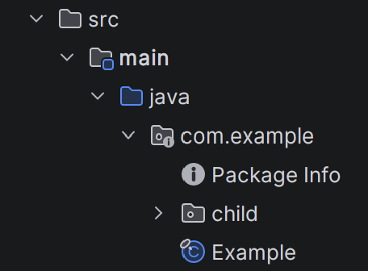
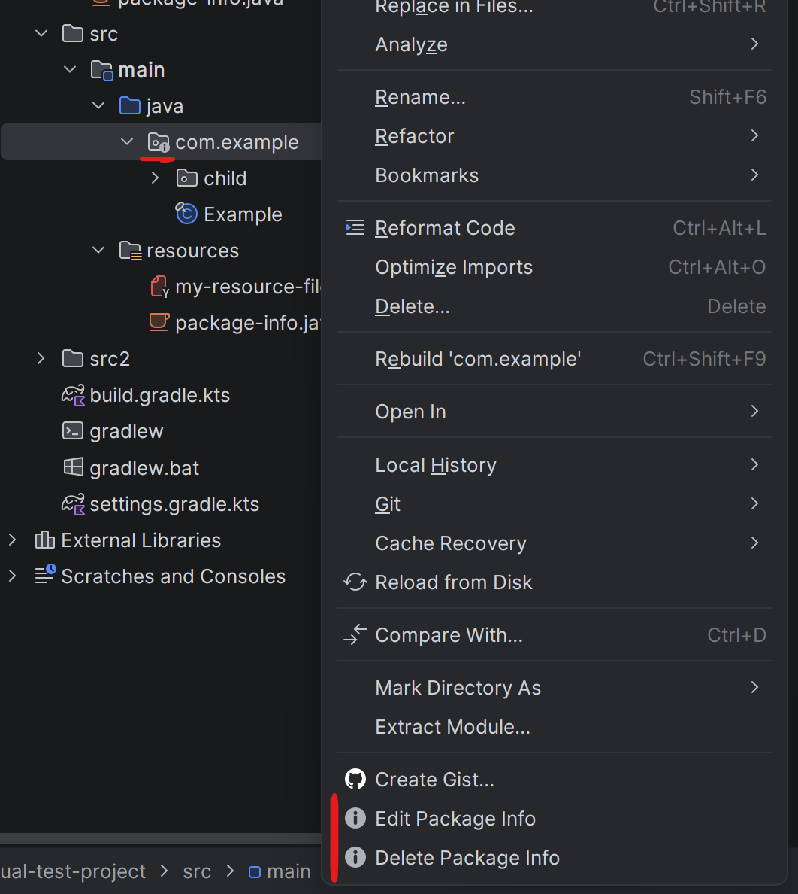
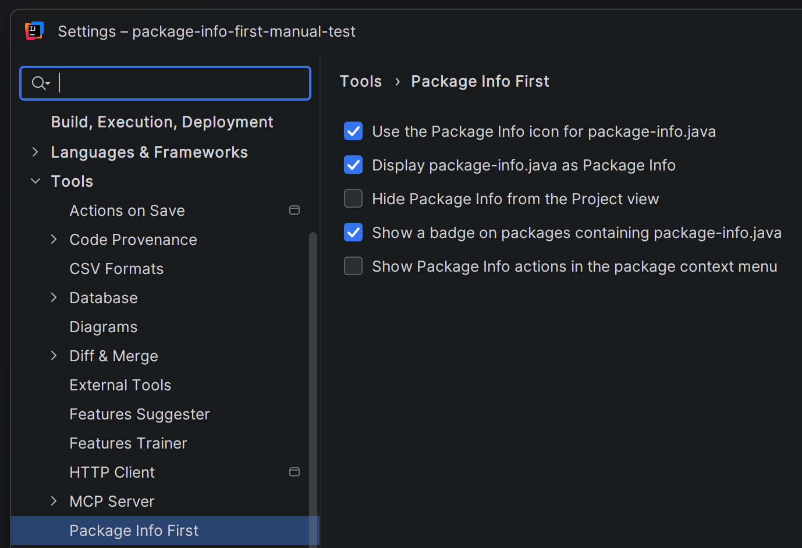

# Package Info First

An IntelliJ IDEA plugin that makes dealing with `package-info.java` a little less annoying.

## Choose how you work

### Keep it visible

Keep `package-info.java` pinned to the top of its package, where it is always easy to find and access.

### Keep it out of the way

Hide `package-info.java` from the Project view while a package badge keeps its presence visible. Context menu actions let you create, edit, or delete the file without hunting for it.

### Configure it your way

Configure the presentation and context menu options under **Settings | Tools | Package Info First**.

## Installation

Download the *package-info-first* zip from [the latest release](https://github.com/VincentSteele/packageinfofirst/releases/latest), then open
**Settings | Plugins**, choose **Install Plugin from Disk**, and select the ZIP without extracting it.

Currently supports IntelliJ IDEA 2024.2 and newer.

## License

This project is licensed under the [MIT License](LICENSE).
